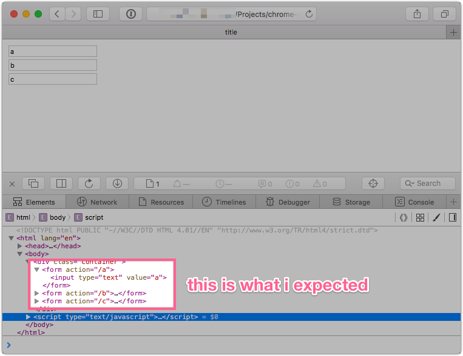
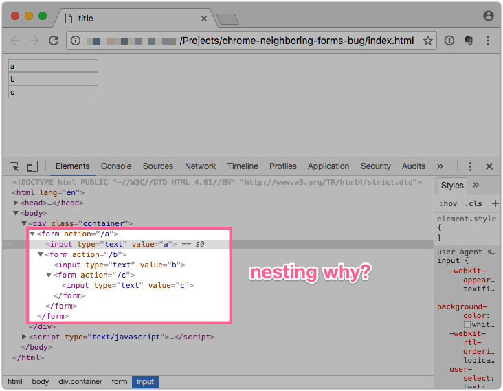

# Chrome Neighboring Forms Bug

I found what appears to be a bug in Chrome 54, evident when inserting html that contains neighboring forms. In the following example I create a template element, set it's innerHTML to three forms each with their own input field, import the node, and then append it to a container div in the document. The javascript is pretty simple:

```javascript
var container = document.querySelector(".container")
var forms = "<form action='/a'><input type='text' value='a'></form><form action='/b'><input type='text' value='b'></form><form action='/c'><input type='text' value='c'></form>"

function prepareNode(html) {
  var template = document.createElement("template")
  template.innerHTML = html
  return document.importNode(template.content, true)
}

container.appendChild(prepareNode(forms))
```

### Safari handles this correctly.



### But Chrome nests the forms



### The solution

I figured out that nesting each `form` in a `div` will prevent the undesired behavior.
